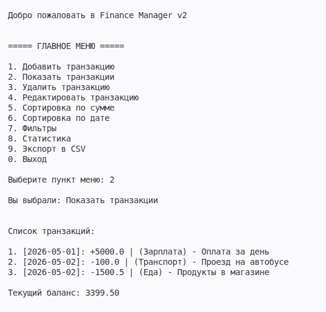

# Finance Manager CLI

Консольное приложение для учета личных финансов с поддержкой хранения данных, фильтрации, сортировки, статистики и экспорта в CSV.

---

# Возможности

## Управление транзакциями
- Добавление транзакций
- Просмотр всех операций
- Редактирование транзакций
- Удаление транзакций

## Статистика
- Подсчет текущего баланса
- Общая сумма доходов
- Общая сумма расходов
- Поиск максимальной транзакции
- Подсчет количества транзакций

## Фильтрация
- По типу (`income` / `expense`)
- По категории
- По сумме больше указанной
- По диапазону суммы
- По диапазону дат
- Универсальная фильтрация через `Callable`

## Сортировка
- По сумме
- По дате
- По возрастанию и убыванию

## Работа с файлами
- Сохранение данных в JSON
- Загрузка данных из JSON
- Экспорт транзакций в CSV

---

# Архитектура проекта

```text
finance_manager/
│
├── app/
│   ├── manager.py        # Бизнес-логика приложения
│   └── transaction.py    # Модель транзакции
│
├── data/
│   ├── data.json         # Хранение данных
│   └── *.csv             # Экспорт CSV
│
├── tests/
│   ├── test_manager.py
│   └── test_transaction.py
│
├── main.py               # CLI-интерфейс
├── requirements.txt
└── README.md
```

---

# Пример возможностей

## Главное меню

- Добавить транзакцию
- Показать транзакции
- Удалить транзакцию
- Редактировать транзакцию
- Сортировка
- Фильтры
- Статистика
- Экспорт CSV

---

## Пример транзакции

```text
[2026-05-11]: +1000.0 | (Зарплата) - Оплата за день
```

---

## Скриншот приложения



---

# Используемые технологии

- Python 3
- ООП
- pathlib
- JSON
- CSV
- pytest
- type hints (`typing`)
- Обработка ошибок (`try/except`)

---

# Что демонстрирует проект

Проект демонстрирует:

- Проектирование классов и разделение ответственности
- Реализацию CLI-интерфейса
- Работу с файловой системой
- Валидацию пользовательского ввода
- Сериализацию данных (JSON)
- Экспорт данных в CSV
- Фильтрацию и сортировку данных
- Использование type hints
- Базовое тестирование с pytest
- Архитектуру небольшого Python-приложения

---

## Запуск проекта

## Клонировать репозиторий

```bash
git clone <repo_url>
```

## Перейти в папку проекта

```bash
cd finance_manager
```

## Запустить приложение

```bash
python main.py
```

---

# Запуск тестов

```bash
pytest
```

---
